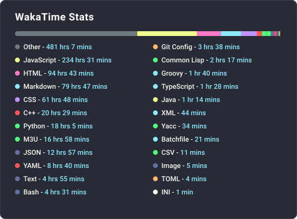
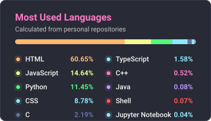
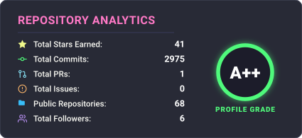
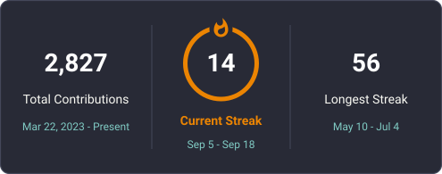
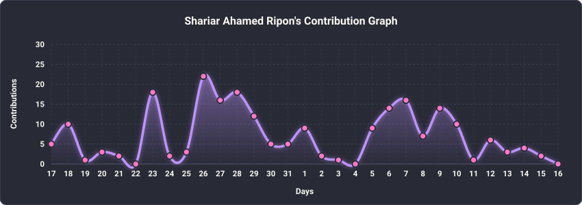

  <picture>
    <source media="(prefers-color-scheme: dark)" srcset="assets/dark.svg?v=3">
    <!-- <source media="(prefers-color-scheme: light)" srcset="assets/light.svg?v=3"> -->
    <source media="(prefers-color-scheme: light)" srcset="assets/dark.svg?v=3">
    
  </picture>

  

<h2>🧑‍💻 About Me</h2>

<ul>
  <li>🎓 B.Sc. in CSE @ <strong>Daffodil International University</strong></li>
  <li>🌍 Based in: <strong>Dhaka, Bangladesh</strong></li>
  <li>🔭 Currently focusing on <strong>Web Development</strong></li>
  <li>🌱 Actively learning <strong>Data Structures</strong></li>
  <li>💬 Languages I speak: <strong>Bangla, English, Hindi</strong></li>
  <li>📫 Reach me anytime: <em>Any social media below</em></li>
  <li>🤝 Always open to <strong>GitHub Collaboration</strong></li>
</ul>

<h2>⚡ Tech Enthusiast Facts</h2>

I’m a curious explorer of code & design. I love:

<ul>
  <li>🧠 Programming & Problem Solving</li>
  <li>🧪 Exploring latest tech trends & tools</li>
  <li>💡 Creating clean, minimal UI designs</li>
  <li>🗺️ Travelling + Data Analysis = My jam</li>
</ul>

<h2>🚀 My Tech Stack</h2>

A complete overview of my skills in frontend, backend, programming, design, and DevOps.

<h3>🎨 Frontend Development</h3>

  
  
  
  
  
  
  

<h3>⚙️ Backend Development</h3>

  
  
  <!--  -->
  
  

<h3>💻 Programming Languages</h3>

  
  
  
  

<h3>🎯 UI/UX Design</h3>

  
  
  
  
  
  <!--  -->

<h3>☁️ Cloud & DevOps</h3>

  
  <!--  -->
  
  
  
  
  

<h3>🛠 Tools & Technologies</h3>

  
  <!--  -->
  
  
  
  
  
  
  
  

<!-- WakaTime GitHub Stats

  

🚀 Powered by <strong><a href="https://wakatime.com/@ShariarAlways">WakaTime</a></strong> — tracking my coding activity in real-time!
 -->

<!-- My Real-time Coding Stats (WakaTime SVG) -->
<h2>⏱️ My Real-time Coding Stats (WakaTime API)</h2>

  
    
  

<!-- 

<!--⏱️ Powered by <a href="https://wakatime.com/@ShariarAlways">WakaTime</a> — tracking my coding activity in real-time!-->

<!--<h2>📊 My Coding Stats</h2>

 -->

  
      
  🚀 Powered by <a href="https://wakatime.com/@ShariarAlways"><b>WakaTime</b></a> — tracking my coding activity in real-time!

<h2>📈 GitHub Stats & Activity</h2>

<!-- Top Languages -->
<!-- 
   
-->

  
    
  <!--  -->
  
    
  <!-- 
    
  -->
  

<!-- Summary Cards -->
<!-- 

  

-->

<!-- Activity Graph -->
<!-- 

  

 
-->

  

<!-- Snake Contribution Grid Animation -->
<picture>
  <source media="(prefers-color-scheme: dark)" srcset="assets/github-contribution-grid-snake.svg">
  <source media="(prefers-color-scheme: light)" srcset="assets/github-contribution-grid-snake.svg">
  
</picture>

<h2>🌐 Connect with Me</h2>

  &nbsp;
  &nbsp;
  &nbsp;
  &nbsp;
  &nbsp;

  <!-- Website -->
  

<!-- Professional
<h2>🌐 Connect with Me</h2>

&nbsp;&nbsp;
&nbsp;&nbsp;
&nbsp;&nbsp;
&nbsp;&nbsp;
&nbsp;&nbsp;

-->

<!--## 🏆 GitHub Achievements

  
  
  
  
  

-->

  
🔒 <strong>Copyright &amp; Intellectual Property Notice</strong>

  
<em>The custom terminal UI, dithered SVG assets, and 3-state morphing particle animations in this profile are exclusively created for <strong>Shariar Ahamed (<a href="https://github.com/Shariar-Ahamed">@Shariar-Ahamed</a>)</strong>. Copying, re-distributing, or modifying these design assets without explicit permission is strictly prohibited. Copyright &copy; 2026 Shariar Ahamed. All Rights Reserved.</em>

